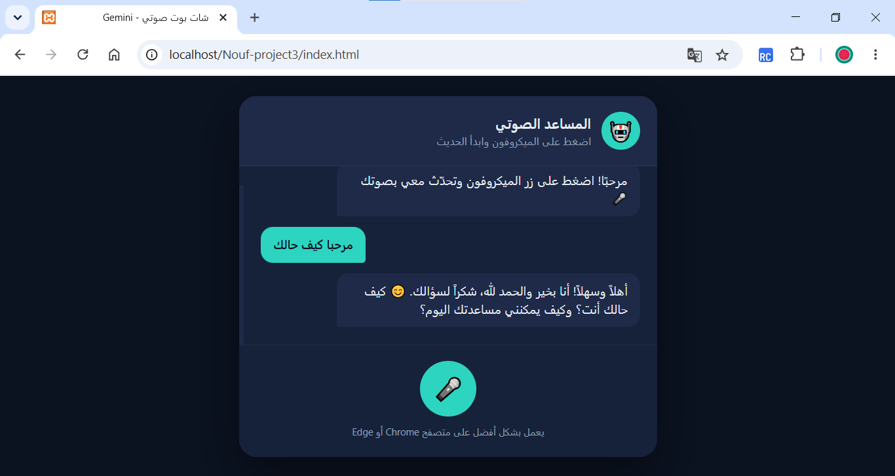

# voice-assistant-chatbot
Voice Assistant Chatbot Project

A web-based Voice Assistant Chatbot built with HTML, CSS, JavaScript, PHP, and the Gemini API.

The project allows users to speak through the microphone, converts speech into text, sends the prompt securely to the backend, receives an AI-generated response from Gemini, and reads the response aloud using text-to-speech.

⸻

Project Goal

This project was completed as a practical assignment with the following objectives:

1. Upload the complete frontend and backend project files to a server.
2. Fix the PHP file responsible for connecting the website to the backend API.
3. Document the development process and submit the final project on GitHub.

The project was developed and tested using XAMPP as the local server environment.

⸻

Features

* Voice input using the browser microphone
* Speech-to-text conversion
* AI-generated responses using the Gemini API
* Text-to-speech output
* Secure backend communication using PHP
* Simple chat interface with Arabic language support
* Runs locally using XAMPP

⸻

Technologies Used

* HTML5
* CSS3
* JavaScript
* PHP
* Gemini API
* XAMPP
* cURL

⸻

Project Structure

project-folder/
│
├── index.html
├── style.css
├── app.js
├── config.php
└── api/
    └── chat.php

⸻

How to Run the Project Using XAMPP

1. Install XAMPP

Install XAMPP on your computer and make sure Apache is running.

2. Move the Project

Copy the project folder into:

C:\xampp\htdocs\

For example:

C:\xampp\htdocs\voice-assistant-chatbot\

3. Start Apache

Open the XAMPP Control Panel and start Apache.

4. Open the Project

Open your browser and visit:

http://localhost/voice-assistant-chatbot/

Replace the folder name if your project directory has a different name.

5. Add Your Gemini API Key

Open config.php and add your Gemini API key:

define('GEMINI_API_KEY', 'YOUR_API_KEY_HERE');

Without a valid API key, the backend cannot communicate with the Gemini API.

⸻

Problem Found

When sending a message, the chatbot displayed the following error:

“حدث خطأ أثناء الاتصال بالخادم، حاول مجددًا.”

This indicated that the frontend request was successfully reaching the server, but the backend PHP script failed while attempting to communicate with the Gemini API.

⸻

Root Cause

After reviewing the backend code, I found that the issue was located in:

api/chat.php

The problem was related to the Gemini model name used in the API request.

The backend was calling the model version gemini-2.0-flash, which was no longer supported after Google discontinued it on June 1, 2026. As a result, all requests sent to that model returned an error because the endpoint was permanently inactive.

⸻

Fix Implemented

The issue was resolved by updating the Gemini model identifier inside api/chat.php.

Before

$model = 'gemini-2.0-flash';

After

$model = 'gemini-3.6-flash';

This one-line change fixed the backend connection problem and allowed the PHP script to communicate successfully with the Gemini API.

⸻

Backend Flow

The application works as follows:

1. The user speaks into the microphone.
2. JavaScript converts the speech into text.
3. The text is sent to api/chat.php using fetch().
4. PHP receives the prompt and sends it to the Gemini API.
5. Gemini generates a response.
6. PHP returns the response as JSON.
7. JavaScript displays the reply and reads it aloud using text-to-speech.

⸻

Screenshot

The image below shows that the application is working correctly after the issue was resolved.

README.md
screenshot1.png

